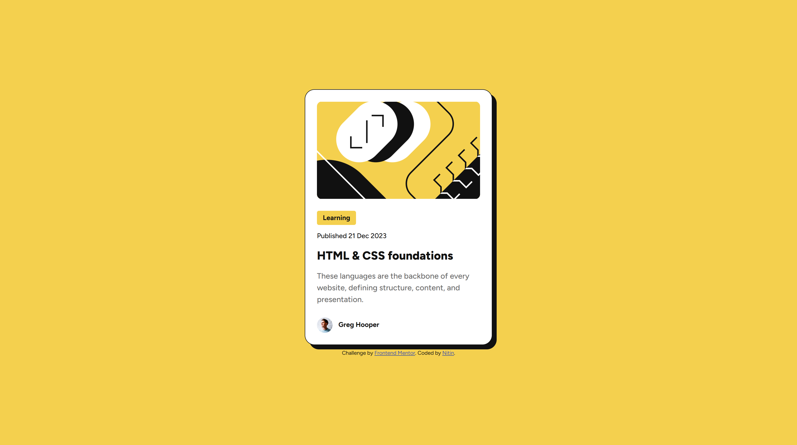

# Frontend Mentor - Blog preview card solution

This is a solution to the [Blog preview card challenge on Frontend Mentor](https://www.frontendmentor.io/challenges/blog-preview-card-ckPaj01IcS). Frontend Mentor challenges help you improve your coding skills by building realistic projects.

## Table of contents

- [Overview](#overview)
  - [The challenge](#the-challenge)
  - [Screenshot](#screenshot)
  - [Links](#links)
- [My process](#my-process)
  - [Built with](#built-with)
  - [What I learned](#what-i-learned)

## Overview

### The challenge

Users should be able to:

- See hover and focus states for all interactive elements on the page

### Screenshot



### Links

- Solution URL: [https://github.com/nitinrs95/blog-preview-card-main.git]
- Live Site URL: [https://nitinrs95.github.io/blog-preview-card-main/]

## My process

### Built with

- Semantic HTML5 markup
- CSS custom properties
- Flexbox
- Mobile-first workflow

### What I learned

**1. HTML**

- I developed a thorough understanding of HTML semantics and improved my ability to apply them effectively. Below is an example of a new HTML tag I learned, which has its own semantic purpose:

```html
<date class="blog__date" datetime="2023-12-21">Published 21 Dec 2023</date>
```

**2. CSS**

- I gained experience working with font files for the first time and learned how to implement them effectively.

```css
@font-face {
  font-family: "Figtree";
  src: url("./assets/fonts/Figtree-VariableFont_wght.ttf") format("truetype-variations");
  font-weight: 100 900;
  font-style: normal;
}

@font-face {
  font-family: "Figtree";
  src: url(./assets/fonts/Figtree-Italic-VariableFont_wght.ttf) format("truetype-variations");
  font-weight: 100 900;
  font-style: italic;
}

@font-face {
  font-family: "Figtree";
  src: url("./assets/fonts/static/Figtree-ExtraBold.ttf") format("truetype");
  font-weight: 800;
  font-style: normal;
}

@font-face {
  font-family: "Figtree";
  src: url(./assets/fonts/static/Figtree-Medium.ttf) format("truetype");
  font-weight: 500;
  font-style: normal;
}
```

**3. CSS Variables**

- I worked with CSS variables, which helped streamline the stylesheet and make it more concise. However, I recognize that I can improve variable naming as I gain more experience.

```css
:root {
  /* Color */
  --yellow: #f4d04e;
  --gray-950: #111111;
  --gray-500: #6b6b6b;

  --white: #ffffff;

  /* Typography */
  --text-preset-small: 700 clamp(1.2rem, 2vw, 1.4rem) / 1.5 "Figtree", sans-serif;
  --text-preset-date: 500 clamp(1.2rem, 2vw, 1.4rem) / 1.5 "Figtree", sans-serif;
  --text-preset-title: 800 clamp(2rem, 2vw, 2.4rem) / 1.5 "Figtree", sans-serif;
  --text-preset-description: 500 clamp(1.4rem, 2vw, 1.6rem) / 1.5 "Figtree", sans-serif;
}
```

**4. clamp()**

- The "Ideas to Test Yourself" section was particularly helpful in enabling me to use the clamp() CSS function, not only for adjusting font sizes but also for creating responsive card container without relying on media queries.

```css
.blog {
  background-color: var(--white);
  display: flex;
  flex-direction: column;
  gap: 2.4rem;
  max-width: clamp(32.7rem, 40%, 38.4rem);
  padding: 2.4rem 2.4rem;
  border-radius: 20px;
  border: 1px solid var(--gray-950);
  box-shadow: 9px 9px var(--gray-950);
}
```
